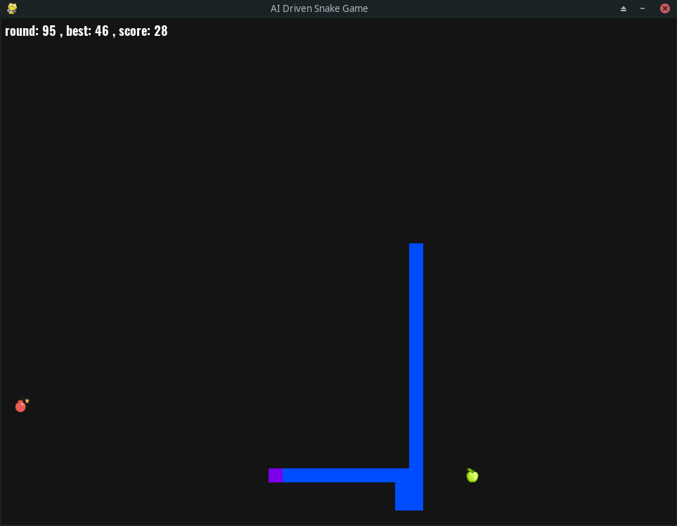

# AI Driven Snake Game

## Introduction
This is a snake game that is powered by AI using Deep Q Learning. The goal of the game is for the snake to eat as many apples as possible without hitting the walls, its own tail, or the bomb. The AI learns to play the game by learning from its own experiences and improving its decision-making over time.

Please note that this is an example!




## Usage
1. To train the model, first install the requirements in `requirements.txt` using the following command:
    ```bash
    pip install -r requirements.txt
    ```

2. Then, run `python agent.py` to start training the model

## Customization
You can customize the game by changing the following parameters in the src/config.py file:

    HEAD_COLOR: The color of the head of the snake
    BODY_COLOR: The color of the body of the snake
    GOAL_IMG: The image of the goal(apple)
    BOMB_IMG: The image of the bomb
    BLOCK_SIZE: The size of the block, snake, and other elements
    MAX_MEMORY: The maximum size of the memory used to store experiences
    N_HIDDEN_LAYERS: The number of hidden layers in the neural network
    GAME_SPEED: The speed at which the game is played

## Conclusion
This AI-driven snake game is a fun and interactive way to learn about AI and deep reinforcement learning. It is a great starting point for anyone who is interested in learning about AI and wants to build their own AI-powered games.